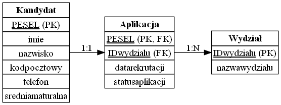

Modele bazy danych
~~~~~~~~~~~~~~~~~~

Konceptualny
^^^^^^^^^^^^

Encje i ich atrybuty:

- Kandydat:
	
	- pesel - PK (klucz główny),
	
	- imie,
	
	- nazwisko,
	
	- telefon,
	
	- kodpocztowy,
	
	- sredniamaturalna,

- Aplikacja:
	
	- pesel - FK (klucz obcy),
	
	- idwydzialu - FK,
	
	- datarekrutacji,

	- statusaplikacji,

- Wydział:
	
	- idwydzialu - PK
		
	- nazwawydzialu.

Związki:

- Kandydat - Aplikacja (1:1),

- Aplikacja - Wydział (N:1).

Aplikacja jest encją słabą, nie posiada własnego klucza. Jest identyfikowana na podstawie encji Kandydat, od której zależy jej istnienie. Przyjmujemy, że każdy kandydat składa tylko jedną aplikację.

.. przedstawić w notacji Chena

Logiczny
^^^^^^^^

	
	Schemat ERD w notacji Barkera

Tabela przed normalizacją

	Rekrutacja - wszystkie dane w jednej tabeli, wszystkie encje w jednej krotce

Model logiczny - pierwotna tabela zostaje podzielona na kilka innych połączonych kluczami. Tabele po normalizacji:

	Kandydaci - pesel to klucz główny
	
	Wydziały - idwydzialu to klucz główny
	
	Aplikacje - pesel jest kluczem zarówno głównym, jak i obcym, IDwydzialu to klucz obcy

Jest to trzecia postać normalna, ponieważ:

- dane są atomowe - każda komórka zawiera tylko jedną wartość (1NF)

- wszystkie atrybuty niekluczowe są zależne od klucza potencjalnego (2NF),

- nie ma zależności przechodnich (3NF).

Fizyczny
^^^^^^^^

Implementacja z użyciem SQLite:

.. code-block:: sql

	CREATE TABLE Kandydat (
	    pesel TEXT PRIMARY KEY,
	    imie TEXT NOT NULL,
	    nazwisko TEXT NOT NULL,
	    kodpocztowy TEXT,
	    telefon TEXT,
	    sredniamaturalna REAL
	);
	
	CREATE TABLE Wydzial (
	    idwydzialu INTEGER PRIMARY KEY,
	    nazwawydzialu TEXT NOT NULL
	);
	
	CREATE TABLE Aplikacja (
	    pesel TEXT,
	    idwydzialu INTEGER,
	    datarekrutacji TEXT NOT NULL,
	    statusaplikacji TEXT,
	
	    PRIMARY KEY (pesel),
	    FOREIGN KEY (pesel) REFERENCES Kandydat(pesel),
	    FOREIGN KEY (idwydzialu) REFERENCES Wydzial(idwydzialu)
	);

Z użyciem PostgreSQL:

.. code-block:: sql

	CREATE TABLE Kandydat (
	    pesel CHAR(11) PRIMARY KEY,
	    imie VARCHAR(100) NOT NULL,
	    nazwisko VARCHAR(100) NOT NULL,
	    kodpocztowy CHAR(6),
	    telefon VARCHAR(20),
	    sredniamaturalna NUMERIC(4, 2)
	);
	
	CREATE TABLE Wydzial (
	    idwydzialu SERIAL PRIMARY KEY,
	    nazwawydzialu VARCHAR(255) NOT NULL
	);
	
	CREATE TABLE Aplikacja (
	    pesel CHAR(11),
	    idwydzialu INTEGER,
	    datarekrutacji DATE NOT NULL,
	    statusaplikacji VARCHAR(30),
	
	    PRIMARY KEY (pesel),
	    FOREIGN KEY (pesel) REFERENCES Kandydat(pesel) ON DELETE CASCADE ON UPDATE CASCADE,
	    FOREIGN KEY (idwydzialu) REFERENCES Wydzial(idwydzialu) ON DELETE RESTRICT ON UPDATE CASCADE
	);

Różnice między zastosowanymi typami danych wynikają z ograniczeń SQLite w zakresie wspieranych typów danych. SQLite nie wspiera również CASCADE.

