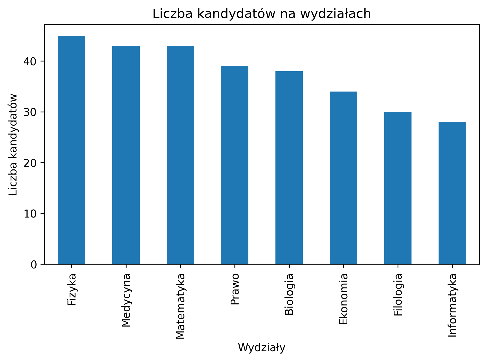

Opis danych przechowywanych w bazie
~~~~~~~~~~~~~~~~~~~~~~~~~~~~~~~~~~~

W obu przypadkach rozmiar zbioru danych pozostaje taki sam; 300 kandydatów, 300 aplikacji (po jednej na kandydata) i 8 wydziałów. Każdy kandydat ma przypisaną średnią ocenę z egzaminów maturalnych.

SQLite
^^^^^^

Podsumowanie kandydatów na wydziałach:

+-------------+-------------------+-----------------------+
| Wydział     | Liczba kandydatów | Średnia ocena z matur |
+=============+===================+=======================+
| Fizyka      | 45                | 68.2                  |
+-------------+-------------------+-----------------------+
| Medycyna    | 43                | 72.8                  |
+-------------+-------------------+-----------------------+
| Matematyka  | 43                | 72.9                  |
+-------------+-------------------+-----------------------+
| Prawo       | 39                | 69.5                  |
+-------------+-------------------+-----------------------+
| Biologia    | 38                | 68.7                  |
+-------------+-------------------+-----------------------+
| Ekonomia    | 34                | 69.3                  |
+-------------+-------------------+-----------------------+
| Filologia   | 30                | 69.1                  |
+-------------+-------------------+-----------------------+
| Informatyka | 28                | 71.4                  |
+-------------+-------------------+-----------------------+

PostgreSQL
^^^^^^^^^^

Podsumowanie kandydatów na wydziałach:

+-------------+-------------------+-----------------------+
| Wydział     | Liczba kandydatów | Średnia ocena z matur |
+=============+===================+=======================+
| Informatyka | 47                | 70.1                  |
+-------------+-------------------+-----------------------+
| Biologia    | 45                | 70.4                  |
+-------------+-------------------+-----------------------+
| Ekonomia    | 39                | 65.0                  |
+-------------+-------------------+-----------------------+
| Fizyka      | 38                | 69.8                  |
+-------------+-------------------+-----------------------+
| Medycyna    | 37                | 66.6                  |
+-------------+-------------------+-----------------------+
| Filologia   | 35                | 69.7                  |
+-------------+-------------------+-----------------------+
| Matematyka  | 33                | 67.4                  |
+-------------+-------------------+-----------------------+
| Prawo       | 26                | 73.1                  |
+-------------+-------------------+-----------------------+

.. image:: diagramy/chart_postgresql.png
	:width: 600
	:height: 450

